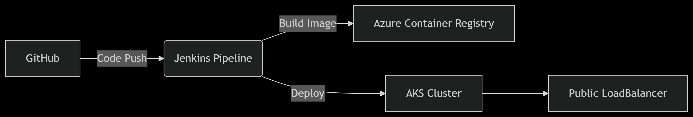

markdown
# Web Deployment to AKS using Jenkins - POC
---
## Prerequisites

### Infrastructure
- Azure account with Owner/Contributor permissions
- Azure CLI installed (`az login` configured)
- Kubernetes CLI (`kubectl`) installed

### Tools on Jenkins Agent
```bash
# Install required tools
sudo apt-get update && sudo apt-get install -y \
    curl \
    docker.io \
    git

# Install kubectl
curl -LO "https://dl.k8s.io/release/$(curl -L -s https://dl.k8s.io/release/stable.txt)/bin/linux/amd64/kubectl"
sudo install -o root -g root -m 0755 kubectl /usr/local/bin/kubectl

# Install Azure CLI
curl -sL https://aka.ms/InstallAzureCLIDeb | sudo bash
## Architecture Diagram


## File Structure
solapp-cicd-poc/
├── .gitignore
├── README.md
├── Jenkinsfile
├── k8s/
│   ├── deployment.yaml
│   ├── service.yaml
├── src/
│   ├── app.py
│   ├── requirements.txt
│   ├── Dockerfile
└── docs/
    └── architecture.png


Setup Steps
1. Create Azure Resources

# Create resource group
az group create --name myweb-poc-rg --location eastus

# Create AKS cluster
az aks create \
  --resource-group myweb-poc-rg \
  --name myweb-poc-aks \
  --node-count 1 \
  --enable-addons monitoring \
  --generate-ssh-keys

# Create ACR
az acr create \
  --resource-group myweb-poc-rg \
  --name mywebpocacr \
  --sku Basic
2. Configure Access
bash
# Attach ACR to AKS
az aks update \
  -g myweb-poc-rg \
  -n myweb-poc-aks \
  --attach-acr mywebpocacr

# Get credentials
az aks get-credentials \
  -g myweb-poc-rg \
  -n myweb-poc-aks \
  --overwrite-existing

Jenkins Pipeline

1. Create Jenkinsfile

pipeline {
    agent any
    environment {
        ACR_NAME = "mywebpocacr"
        AKS_NAMESPACE = "myweb-poc-ns"
    }
    stages {
        stage('Checkout') {
            steps {
                git 'https://github.com/your-repo/solapp-cicd-poc.git'
            }
        }
        stage('Build & Push') {
            steps {
                withCredentials([usernamePassword(
                    credentialsId: 'acr-credentials',
                    usernameVariable: 'ACR_USER',
                    passwordVariable: 'ACR_PASS'
                )]) {
                    sh """
                        docker build -t ${ACR_NAME}.azurecr.io/myweb-app:latest .
                        echo \$ACR_PASS | docker login ${ACR_NAME}.azurecr.io -u \$ACR_USER --password-stdin
                        docker push ${ACR_NAME}.azurecr.io/myweb-app:latest
                    """
                }
            }
        }
        stage('Deploy') {
            steps {
                sh """
                    kubectl create ns ${AKS_NAMESPACE} --dry-run=client -o yaml | kubectl apply -f -
                    kubectl apply -f k8s/deployment.yaml -n ${AKS_NAMESPACE}
                    kubectl apply -f k8s/service.yaml -n ${AKS_NAMESPACE}
                """
            }
        }
    }
}

2. Jenkins Credentials
ACR Credentials:

ID: acr-credentials

Username: ACR name (mywebpocacr)

Password: From az acr credential show

Azure SP Credentials (for deployments):

ID: azure-credentials

Service Principal details

Testing Procedure
1. Verify Deployment
kubectl get all -n myweb-poc-ns

2. Access Application
kubectl port-forward svc/myweb-service -n myweb-poc-ns 8080:80
Access: http://localhost:8080

3. Smoke Test
curl -v http://<EXTERNAL-IP>

Troubleshooting
Error	Solution
ImagePullBackOff	Check az aks update --attach-acr
CrashLoopBackOff	Check logs with kubectl logs --previous
403 Forbidden	Verify ACR credentials

Cleanup
az group delete --name myweb-poc-rg --yes --no-wait
